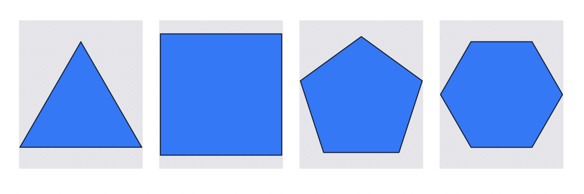

<p align="center">
  
</p>

<p align="center">
    
    
	
	
</p>

# Polygon 
Draws an equilateral polygon of any side within any SwiftUI or UIView. Extremely simply API. An example of individual polygons from triangle to 16-sided-polygon.

<p align="center">
  
</p>

<br/>

## ... or you can tile them in any frame
<p align="center">
  
</p>

## Polygon Usage - SwiftUI

```
var body: some View {
  // Single Polygon
  Polygon(numberOfSides: 5, // draws a pentagon
          fillColor: .green, // the color to fill the polygon width
          rotationAngle: Angle(degrees: 30), // rotate the shape in any angle
          borderWidth: 2,
          borderColor: .black)
}

var body: some View {
  // Tile Hexagons in the view
  TiledPolygon()
     .kind(Hexagon())
     .interTileSpacing(2) // space between adjacent tiles
     .fillColorPattern(Color.viridisPalette) //apply multi color
     .polygonSize(TileablePolygonSize(fixedWidth: 64) //size of each tile
     .background(Color.gray) // inter-tiling color
}

```

## Polygon Usage - UIKit
```
let pentagon = UIPolygon()
pentagon.fillColor = UIColor.green // the color to fill the polygon width
pentagon.numberOfSides = 5 // draws a pentagon
pentagon.rotationAngle = 30 // rotate the shape in any angle between -179° thru 180°
pentagon.borderWidth = 2
// Add the polygon to a view

let tiledPolygon = UITiledPolygon()
tiledPolygon.tileablePolygonKind = Hexagon() //tile hexagons
tiledPolygon.interTileSpacing = 2.0 // space between adjacent tiles      
tiledPolygon.polygonSize = TileablePolygonSize(fixedWidth: 64) //size of each tile
tiledPolygon.backgroundColor = .systemGray5 // inter-tiling color

```

## Individual Polygon Result
<p align="center">
    
</p>

<br/>

## Tiled Polygons Result
<p align="center">
    
</p>

<br/>

## Installation (iOS, macOS, macCatalyst)

### Swift Package Manager 
Add Polygon to your project via Swift Package Manager.

`https://github.com/eclypse-tms/Polygon`


<br/>

### Manually
Drop the [source files](https://github.com/eclypse-tms/Polygon/tree/version_1/Sources/Polygon) into your project.

<br/>

## Breaking Change with version 2
Since we added support for SwiftUI, previously named `Polygon` class has been renamed to `UIPolygon` to follow the UIKit's convention. The class name `Polygon` is now used for SwiftUI variation.

<br/>

## Animatable Polygons in UIKit

UIPolygon is also animatable since it draws its shape on a sublayer. This opens up the possibility of applying any CAAnimation on a polygon. Example: 

```
let pentagon = UIPolygon()
pentagon.backgroundColor = .systemGray5 //optional background color
pentagon.fillColor = UIColor.green // the color to fill the polygon width
pentagon.numberOfSides = 5 // draws a pentagon
... other code

//create a fade-out animation
let opacityAnimation = CABasicAnimation(keyPath: #keyPath(CALayer.opacity))
opacityAnimation.fromValue = Float(1.0)
opacityAnimation.toValue = Float(0.0)
opacityAnimation.duration = 0.5
pentagon.apply(animation: opacityAnimation)
```

<p align="center">
    
</p>

<br/>

## Polygons in SwiftUI are animatable 
In SwiftUI, the Polygon class conforms to the `Shape` protocol - which makes them animatable.


