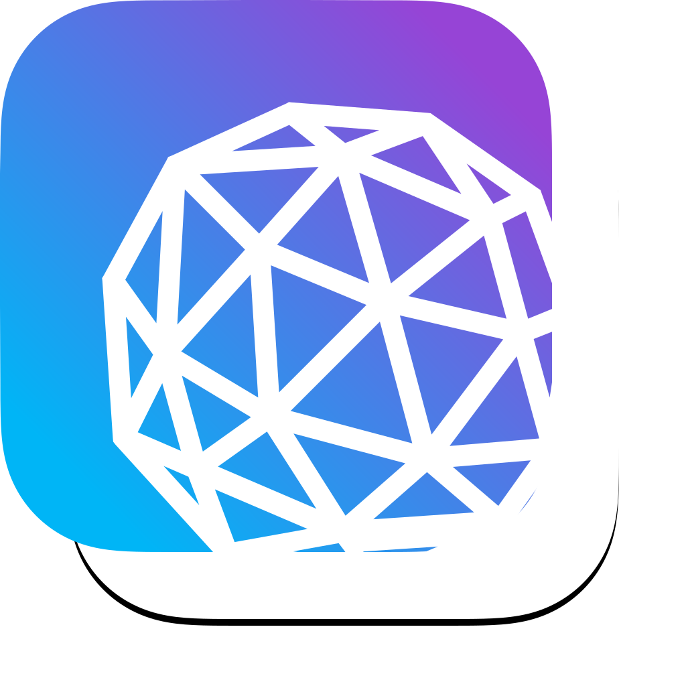

<p align="center">
  
</p>

<p align="center">
    
    
    
</p>

# Polygon 

Draws an equilateral polygon of any sides within your UIView.

<p align="center">
  
</p>

## Installation (iOS, watchOS, tvOS, macCatalyst)

### Swift Package Manager 
Add Polygon to your project via Swift Package Manager.

`https://github.com/eclypse-tms/Polygon`

### Manually
Drop the [source files](https://github.com/eclypse-tms/Polygon/tree/version_1/Sources/Polygon) into your project.


## Polygon Usage
```
let pentagon = Polygon()
pentagon.backgroundColor = .systemGray5 //optional background color
pentagon.fillColor = UIColor.green // the color to fill the polygon width
pentagon.numberOfSides = 5 // draws a pentagon
pentagon.rotationAngle = 30 // rotate the shape in any angle between -179° thru 180°
pentagon.borderWidth = 2
// Add the polygon to a view
```

## Result
<p align="center">
    
</p>

## Animatable Polygon Variation

The library includes another variation called `AnimatablePolygon`. You can freely use one or the other according to your needs. AnimatablePolygon works exactly the same way as the vanilla Polygon except that it draws its shape on a sublayer. This opens up the possibility of applying any CAAnimation on that sublayer. 

```
let pentagon = AnimatablePolygon()
pentagon.backgroundColor = .systemGray5 //optional background color
pentagon.fillColor = UIColor.green // the color to fill the polygon width
pentagon.numberOfSides = 5 // draws a pentagon
pentagon.rotationAngle = 30 // rotate the shape in any angle between -179° thru 180°
pentagon.borderWidth = 2
// Add the polygon to a view

//create an animation
let opacityAnimation = CABasicAnimation(keyPath: #keyPath(CALayer.opacity))
opacityAnimation.fromValue = Float(1.0)
opacityAnimation.toValue = Float(0.0)
opacityAnimation.duration = 0.5
pentagon.apply(animation: opacityAnimation)
```

<p align="center">
    
</p>

